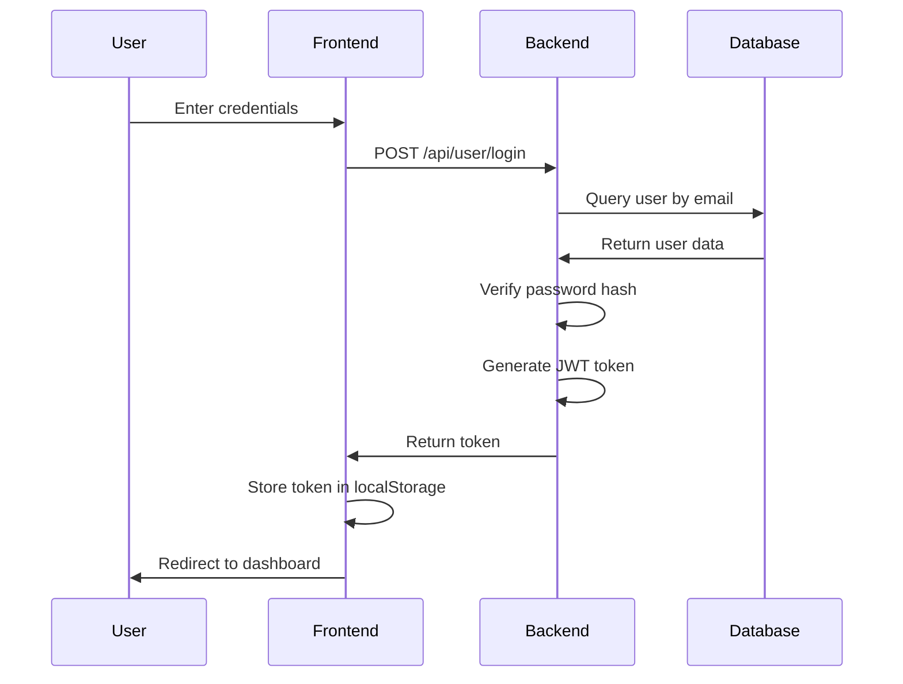
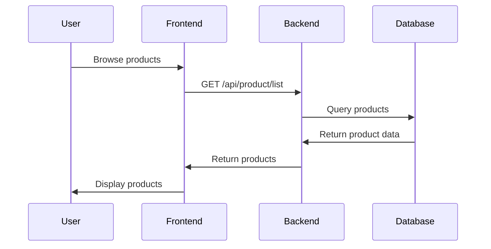
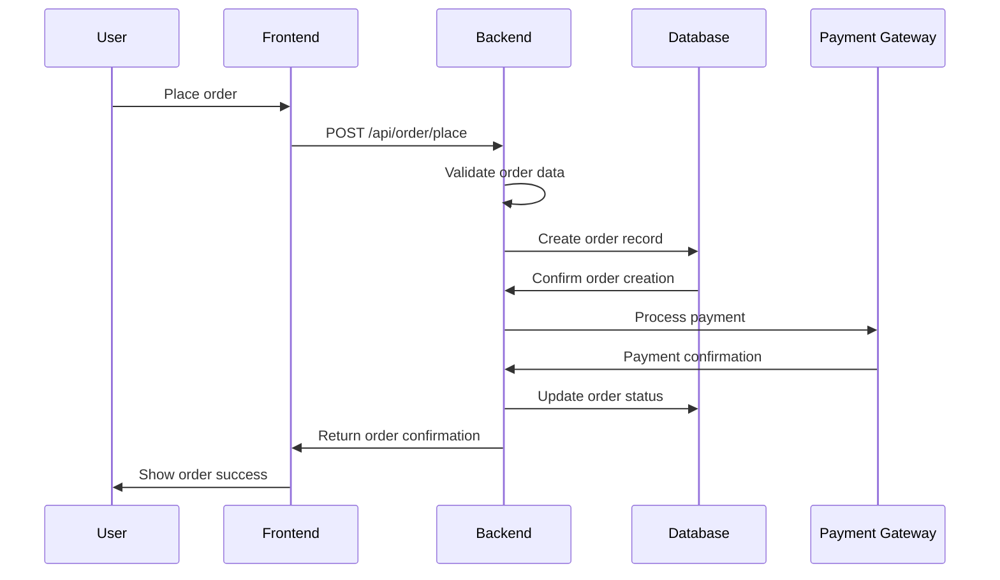
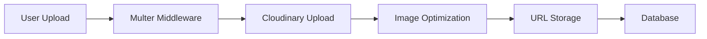

# Technical Architecture Documentation

## System Overview

ShopMee is a full-stack e-commerce platform built with modern web technologies. The system follows a three-tier architecture pattern with clear separation of concerns between presentation, business logic, and data layers.

## Architecture Diagram

```
┌─────────────────────────────────────────────────────────────────┐
│                        Client Layer                            │
├─────────────────────────────────────────────────────────────────┤
│  ┌─────────────────┐  ┌─────────────────┐  ┌─────────────────┐ │
│  │   Frontend      │  │   Admin Panel   │  │   Mobile Web    │ │
│  │   (React)       │  │   (React)       │  │   (Responsive)  │ │
│  └─────────────────┘  └─────────────────┘  └─────────────────┘ │
└─────────────────────────────────────────────────────────────────┘
                                │
                                │ HTTP/HTTPS
                                ▼
┌─────────────────────────────────────────────────────────────────┐
│                      API Gateway Layer                         │
├─────────────────────────────────────────────────────────────────┤
│  ┌─────────────────────────────────────────────────────────────┐ │
│  │                    Express.js Server                       │ │
│  │  ┌─────────────┐ ┌─────────────┐ ┌─────────────┐         │ │
│  │  │   Routes    │ │ Middleware  │ │ Controllers │ │         │ │
│  │  └─────────────┘ └─────────────┘ └─────────────┘         │ │
│  └─────────────────────────────────────────────────────────────┘ │
└─────────────────────────────────────────────────────────────────┘
                                │
                                │ Database Queries
                                ▼
┌─────────────────────────────────────────────────────────────────┐
│                      Data Layer                                │
├─────────────────────────────────────────────────────────────────┤
│  ┌─────────────────┐  ┌─────────────────┐  ┌─────────────────┐ │
│  │   PostgreSQL    │  │   Cloudinary    │  │   Payment       │ │
│  │   Database      │  │   (Images)      │  │   Gateways      │ │
│  └─────────────────┘  └─────────────────┘  └─────────────────┘ │
└─────────────────────────────────────────────────────────────────┘
```

## Technology Stack

### Frontend Technologies
- **React 19** - Modern UI framework with hooks and functional components
- **React Router** - Client-side routing and navigation
- **Tailwind CSS** - Utility-first CSS framework for styling
- **Axios** - HTTP client for API communication
- **React Toastify** - Toast notifications
- **Vite** - Build tool and development server

### Backend Technologies
- **Node.js** - JavaScript runtime environment
- **Express.js** - Web application framework
- **Sequelize** - Object-Relational Mapping (ORM)
- **PostgreSQL** - Relational database
- **JWT** - JSON Web Tokens for authentication
- **bcrypt** - Password hashing
- **Multer** - File upload middleware
- **CORS** - Cross-Origin Resource Sharing

### External Services
- **Cloudinary** - Cloud image storage and optimization
- **Razorpay** - Payment gateway (India)
- **Stripe** - Payment gateway (International)
- **Vercel** - Frontend hosting and deployment
- **Railway/Render** - Backend hosting and deployment

## Component Architecture

### 1. Frontend Components

#### Core Components
```
src/
├── components/
│   ├── Navbar.jsx          # Navigation bar
│   ├── Footer.jsx          # Footer component
│   ├── SearchBar.jsx       # Search functionality
│   ├── BestSeller.jsx      # Featured products
│   ├── CartTotal.jsx       # Cart summary
│   └── ...
├── pages/
│   ├── Home.jsx            # Landing page
│   ├── Collection.jsx      # Product listing
│   ├── Product.jsx         # Product details
│   ├── Cart.jsx            # Shopping cart
│   ├── Login.jsx           # Authentication
│   ├── PlaceOrder.jsx      # Checkout process
│   ├── Orders.jsx          # Order history
│   └── ...
├── context/
│   └── ShopContext.jsx     # Global state management
└── utils/
    └── formatPrice.js      # Utility functions
```

#### State Management
- **React Context API** - Global state management
- **Local Storage** - Cart persistence
- **Session Storage** - User session data

### 2. Backend Components

#### API Structure
```
backend/
├── config/
│   ├── postgredb.js        # Database configuration
│   └── cloudinary.js       # Cloudinary configuration
├── controllers/
│   ├── userController.js    # User authentication logic
│   ├── productController.js # Product management
│   ├── cartController.js    # Cart operations
│   └── orderControler.js   # Order processing
├── middleware/
│   ├── auth.js             # User authentication
│   ├── adminAuth.js        # Admin authentication
│   └── multer.js           # File upload handling
├── models/
│   ├── userModel.js        # User data model
│   ├── productModel.js     # Product data model
│   └── orderModel.js       # Order data model
├── routes/
│   ├── userRoute.js        # User endpoints
│   ├── productRoute.js     # Product endpoints
│   ├── cartRout.js         # Cart endpoints
│   └── orderRout.js        # Order endpoints
└── server.js               # Main server file
```

## Data Flow Architecture

### 1. User Authentication Flow



### 2. Product Browsing Flow



### 3. Order Processing Flow



## Security Architecture

### 1. Authentication & Authorization

#### JWT Token Structure
```javascript
{
  "id": "user_id",
  "iat": "issued_at_timestamp",
  "exp": "expiration_timestamp"
}
```

#### Token Management
- **Access Token**: Short-lived (24 hours)
- **Refresh Token**: Not implemented (future enhancement)
- **Token Storage**: localStorage for frontend
- **Token Validation**: Middleware on protected routes

### 2. Data Protection

#### Password Security
```javascript
// Password hashing with bcrypt
const salt = await bcrypt.genSalt(10);
const hashedPassword = await bcrypt.hash(password, salt);
```

#### Input Validation
- **Email validation** using validator.js
- **Password strength** requirements
- **SQL injection** prevention via Sequelize
- **XSS protection** via input sanitization

### 3. API Security

#### CORS Configuration
```javascript
app.use(cors({
  origin: ['http://localhost:3000', 'https://yourdomain.com'],
  credentials: true
}));
```

#### Rate Limiting
- Not implemented (future enhancement)
- Consider implementing with express-rate-limit

## Database Architecture

### 1. Schema Design

#### Normalization
- **First Normal Form**: All attributes are atomic
- **Second Normal Form**: No partial dependencies
- **Third Normal Form**: No transitive dependencies

#### Relationships
- **Users → Orders**: One-to-Many
- **Users → Cart**: One-to-One (JSON storage)

### 2. Indexing Strategy

#### Primary Indexes
- All primary keys are auto-indexed
- Foreign keys are indexed automatically

#### Secondary Indexes
```sql
-- User email for fast login
CREATE INDEX idx_users_email ON "Users"(email);

-- Product category for filtering
CREATE INDEX idx_products_category ON "Products"(category);

-- Order status for filtering
CREATE INDEX idx_orders_status ON "Orders"(status);
```

### 3. Data Types

#### JSON Storage
- **Cart Data**: Flexible structure for cart items
- **Order Items**: Array of product details
- **Address**: Structured shipping information

#### Array Storage
- **Product Images**: Array of image URLs
- **Product Sizes**: Array of available sizes

## API Architecture

### 1. RESTful Design

#### Resource-Based URLs
```
/api/user/*          # User management
/api/product/*       # Product operations
/api/cart/*          # Cart operations
/api/order/*         # Order management
```

#### HTTP Methods
- **GET**: Retrieve data
- **POST**: Create data
- **PUT**: Update data (not implemented)
- **DELETE**: Remove data (not implemented)

### 2. Response Format

#### Success Response
```json
{
  "success": true,
  "message": "Operation successful",
  "data": { ... }
}
```

#### Error Response
```json
{
  "success": false,
  "message": "Error description"
}
```

### 3. Error Handling

#### Global Error Handler
```javascript
app.use((err, req, res, next) => {
  console.error(err.stack);
  res.status(500).json({
    success: false,
    message: 'Internal server error'
  });
});
```

## File Upload Architecture

### 1. Image Processing Pipeline



### 2. Cloudinary Integration
- **Image Upload**: Direct to Cloudinary
- **Image Optimization**: Automatic resizing and compression
- **CDN Delivery**: Global content delivery
- **Format Conversion**: Automatic format optimization

## Payment Architecture

### 1. Payment Gateway Integration

#### Razorpay Flow
```javascript
// Create payment order
const order = await razorpay.orders.create({
  amount: amount * 100, // Convert to paise
  currency: 'INR',
  receipt: 'order_receipt'
});
```

#### Stripe Flow
```javascript
// Create payment intent
const paymentIntent = await stripe.paymentIntents.create({
  amount: amount * 100, // Convert to cents
  currency: 'usd',
  metadata: { orderId: orderId }
});
```

### 2. Webhook Processing
- **Payment Verification**: Secure webhook handling
- **Order Status Updates**: Automatic status changes
- **Error Handling**: Failed payment recovery

## Performance Architecture

### 1. Frontend Optimization

#### Code Splitting
```javascript
// Lazy loading of components
const Product = lazy(() => import('./pages/Product'));
const Cart = lazy(() => import('./pages/Cart'));
```

#### Image Optimization
- **Lazy Loading**: Images load on scroll
- **Responsive Images**: Different sizes for different devices
- **WebP Format**: Modern image format support

### 2. Backend Optimization

#### Database Optimization
- **Connection Pooling**: Efficient database connections
- **Query Optimization**: Indexed queries
- **Caching**: Future enhancement with Redis

#### API Optimization
- **Response Compression**: Gzip compression
- **Pagination**: Large dataset handling
- **Caching**: Response caching (future)

## Scalability Considerations

### 1. Horizontal Scaling

#### Load Balancing
- **Multiple Instances**: Deploy multiple backend instances
- **Database Replicas**: Read replicas for high traffic
- **CDN**: Global content delivery

#### Microservices Architecture (Future)
```
┌─────────────────┐  ┌─────────────────┐  ┌─────────────────┐
│   User Service  │  │ Product Service │  │  Order Service  │
└─────────────────┘  └─────────────────┘  └─────────────────┘
         │                     │                     │
         └─────────────────────┼─────────────────────┘
                               │
                    ┌─────────────────┐
                    │   API Gateway   │
                    └─────────────────┘
```

### 2. Vertical Scaling

#### Resource Optimization
- **Memory Management**: Efficient memory usage
- **CPU Optimization**: Optimized algorithms
- **Storage Optimization**: Efficient data storage

## Monitoring and Logging

### 1. Application Monitoring

#### Performance Metrics
- **Response Time**: API response times
- **Throughput**: Requests per second
- **Error Rate**: Error percentage
- **Uptime**: Service availability

#### Health Checks
```javascript
// Health check endpoint
app.get('/health', (req, res) => {
  res.json({
    status: 'healthy',
    timestamp: new Date().toISOString(),
    uptime: process.uptime()
  });
});
```

### 2. Error Tracking

#### Error Logging
```javascript
// Global error handler
app.use((err, req, res, next) => {
  console.error('Error:', err);
  // Send to error tracking service
  res.status(500).json({ error: 'Internal server error' });
});
```

## Deployment Architecture

### 1. Environment Configuration

#### Development
```env
NODE_ENV=development
PORT=4000
DB_HOST=localhost
```

#### Production
```env
NODE_ENV=production
PORT=4000
DB_HOST=production-db-host
```

### 2. CI/CD Pipeline (Future)

```yaml
# GitHub Actions workflow
name: Deploy
on:
  push:
    branches: [main]
jobs:
  deploy:
    runs-on: ubuntu-latest
    steps:
      - uses: actions/checkout@v2
      - name: Deploy to Railway
        run: railway up
```

## Security Best Practices

### 1. OWASP Top 10 Compliance

- **SQL Injection**: Prevented by Sequelize ORM
- **XSS**: Input sanitization and output encoding
- **CSRF**: JWT tokens and CORS configuration
- **Insecure Direct Object References**: Proper authorization
- **Security Misconfiguration**: Environment variables

### 2. Data Privacy

#### GDPR Compliance
- **Data Minimization**: Collect only necessary data
- **User Consent**: Clear privacy policy
- **Data Portability**: Export user data capability
- **Right to be Forgotten**: Delete user data

## Future Enhancements

### 1. Technical Improvements
- **GraphQL**: Replace REST API
- **Redis**: Caching layer
- **Elasticsearch**: Advanced search
- **WebSockets**: Real-time features

### 2. Feature Additions
- **Multi-language**: Internationalization
- **Advanced Analytics**: User behavior tracking
- **Recommendation Engine**: AI-powered suggestions
- **Mobile App**: React Native application

### 3. Infrastructure
- **Kubernetes**: Container orchestration
- **Docker**: Containerization
- **Microservices**: Service decomposition
- **Event Sourcing**: Event-driven architecture 